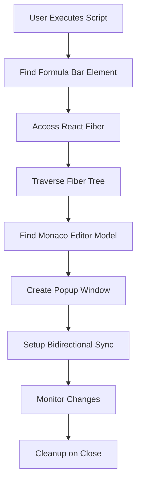

# PowerApps Popup Formula Bar - Code Review & Improvement Guide

## Table of Contents
1. [Executive Summary](#executive-summary)
2. [Current Architecture Overview](#current-architecture-overview)
3. [Critical Security Issues](#critical-security-issues)
4. [Code Quality Issues](#code-quality-issues)
5. [Performance Concerns](#performance-concerns)
6. [Detailed Fixes and Explanations](#detailed-fixes-and-explanations)
7. [Refactoring Recommendations](#refactoring-recommendations)
8. [Implementation Roadmap](#implementation-roadmap)

---

## Executive Summary

This document provides a comprehensive review of the PowerApps Popup Formula Bar codebase, identifying critical issues, explaining their impact, and providing detailed solutions. The code successfully achieves its core functionality but has several areas requiring immediate attention for security, reliability, and maintainability.

### Key Findings:
- **1 Critical Security Issue**: XSS vulnerability in popup window creation
- **5 High Priority Issues**: Error handling, memory management, race conditions
- **8 Medium Priority Issues**: Code structure, browser compatibility, UX improvements
- **Multiple Enhancement Opportunities**: Modularization, testing, build process

---

## Current Architecture Overview

### How the Code Works

The application follows this flow:



### Core Components

1. **React Fiber Traversal** (Lines 2-76)
   - Searches through React's internal fiber structure
   - Uses depth-limited traversal to prevent infinite loops
   - Identifies Monaco editor by its unique methods

2. **Model Detection** (Lines 17-28)
   - Checks for specific Monaco editor methods
   - Validates the found object is the correct editor instance

3. **Synchronization Logic** (Lines 98-135)
   - Bidirectional sync between popup and main editor
   - Handles property changes and flush events
   - Uses flags to prevent infinite update loops

4. **Cleanup Management** (Lines 137-143)
   - Monitors popup window status
   - Disposes event listeners when closed
   - Prevents memory leaks

---

## Critical Security Issues

### 1. XSS (Cross-Site Scripting) Vulnerability

**Location**: Lines 86-89

**Current Code (VULNERABLE)**:
```javascript
popup.document.write(`
  <title>Formula Editor</title>
  <textarea id="formulaInput" style="width:100%; height:100%; font-family:monospace; font-size:14px;"></textarea>
`);
```

**Why This Is Dangerous**:
- `document.write()` executes any JavaScript in the string
- If extended to include dynamic content, could execute malicious scripts
- No Content Security Policy protection
- Popup window has access to parent window context

**Impact**:
- Potential code execution in PowerApps context
- Data theft possibilities
- Session hijacking risk

**SECURE FIX**:
```javascript
// Method 1: DOM Manipulation (Recommended)
const popup = window.open("", "FormulaPopup", "width=800,height=400");

// Set up proper HTML structure
popup.document.documentElement.innerHTML = `
  <!DOCTYPE html>
  <html>
    <head>
      <title>Formula Editor</title>
      <meta charset="UTF-8">
      <meta name="viewport" content="width=device-width, initial-scale=1.0">
      <style>
        body { margin: 0; padding: 0; }
        #formulaInput {
          width: 100%;
          height: 100vh;
          font-family: 'Consolas', 'Monaco', monospace;
          font-size: 14px;
          border: none;
          outline: none;
          resize: none;
          padding: 10px;
          box-sizing: border-box;
        }
      </style>
    </head>
    <body>
      <textarea id="formulaInput" placeholder="Enter your formula here..."></textarea>
    </body>
  </html>
`;

// Method 2: Using createElement (Most Secure)
const popup = window.open("", "FormulaPopup", "width=800,height=400");
const doc = popup.document;

// Clear and set DOCTYPE
doc.open();
doc.close();

// Create elements safely
const title = doc.createElement('title');
title.textContent = 'Formula Editor';
doc.head.appendChild(title);

const style = doc.createElement('style');
style.textContent = `
  body { margin: 0; padding: 0; }
  #formulaInput {
    width: 100%;
    height: 100vh;
    font-family: 'Consolas', 'Monaco', monospace;
    font-size: 14px;
    border: none;
    outline: none;
    resize: none;
    padding: 10px;
    box-sizing: border-box;
  }
`;
doc.head.appendChild(style);

const textarea = doc.createElement('textarea');
textarea.id = 'formulaInput';
textarea.placeholder = 'Enter your formula here...';
doc.body.appendChild(textarea);
```

---

## Code Quality Issues

### 2. Missing Null/Undefined Checks

**Location**: Line 96, 112, 119

**Current Code (UNSAFE)**:
```javascript
let selectedProperty = window.fxSelector.attributes["value"].value;
```

**Problems**:
- Assumes `window.fxSelector` exists
- Assumes `attributes` exists
- Assumes `value` attribute exists
- No error handling if any of these are undefined

**Impact**:
- Script crashes with "Cannot read property of undefined"
- User gets no feedback about the failure
- Difficult to debug in production

**ROBUST FIX**:
```javascript
// Safe property access with fallback
function getSelectedProperty() {
  try {
    const selector = window.fxSelector;
    if (!selector) {
      console.warn('Property selector not found');
      return null;
    }
    
    const valueAttr = selector.getAttribute('value');
    if (valueAttr === null) {
      console.warn('No value attribute on property selector');
      return null;
    }
    
    return valueAttr;
  } catch (error) {
    console.error('Error getting selected property:', error);
    return null;
  }
}

let selectedProperty = getSelectedProperty();

// Later usage with null check
if (selectedProperty && selectedProperty === getSelectedProperty()) {
  // Safe to proceed
}
```

### 3. Silent Error Suppression

**Location**: Lines 25, 49

**Current Code (BAD PRACTICE)**:
```javascript
try {
  // ... code
} catch {
  return false;  // Line 25
}

try {
  const val = current[key];
  // ... code
} catch {}  // Line 49 - completely empty
```

**Problems**:
- Errors are silently swallowed
- No logging for debugging
- Could hide critical issues
- Makes troubleshooting impossible

**PROPER ERROR HANDLING**:
```javascript
// Example 1: Informative error handling
try {
  return (
    obj &&
    typeof obj.getValue === "function" &&
    typeof obj.setValue === "function" &&
    typeof obj.doesFxEditorHaveMultipleLines === "function"
  );
} catch (error) {
  // Log error for debugging but don't break the flow
  if (window.POPUP_BAR_LOGGING) {
    console.debug('Error checking model methods:', error);
  }
  return false;
}

// Example 2: Safe property access with logging
try {
  const val = current[key];
  if (typeof val === "object" && val !== null) {
    stack.push({ value: val, depth: depth + 1 });
  }
} catch (error) {
  // Some objects throw on property access (getters, proxies)
  if (window.POPUP_BAR_LOGGING) {
    console.debug(`Cannot access property ${key}:`, error.message);
  }
  // Continue traversal despite this property being inaccessible
}
```

### 4. Poor User Feedback

**Location**: Line 83

**Current Code (POOR UX)**:
```javascript
if (!model) return alert("Formula model not found.");
```

**Problems**:
- `alert()` is blocking and jarring
- No helpful information for users
- No suggestions for resolution
- Disrupts workflow

**BETTER USER FEEDBACK**:
```javascript
function showError(message, details = '', suggestions = []) {
  // Create a non-blocking notification
  const notification = document.createElement('div');
  notification.style.cssText = `
    position: fixed;
    top: 20px;
    right: 20px;
    background: #f44336;
    color: white;
    padding: 16px;
    border-radius: 4px;
    box-shadow: 0 2px 5px rgba(0,0,0,0.2);
    z-index: 10000;
    max-width: 400px;
    font-family: system-ui, -apple-system, sans-serif;
  `;
  
  notification.innerHTML = `
    <div style="font-weight: bold; margin-bottom: 8px;">⚠️ ${message}</div>
    ${details ? `<div style="font-size: 14px; margin-bottom: 8px;">${details}</div>` : ''}
    ${suggestions.length ? `
      <div style="font-size: 14px; margin-top: 8px;">
        <strong>Try:</strong>
        <ul style="margin: 4px 0; padding-left: 20px;">
          ${suggestions.map(s => `<li>${s}</li>`).join('')}
        </ul>
      </div>
    ` : ''}
    <button onclick="this.parentElement.remove()" style="
      background: white;
      color: #f44336;
      border: none;
      padding: 4px 8px;
      border-radius: 2px;
      cursor: pointer;
      margin-top: 8px;
    ">Dismiss</button>
  `;
  
  document.body.appendChild(notification);
  
  // Auto-remove after 10 seconds
  setTimeout(() => notification.remove(), 10000);
}

// Usage
if (!model) {
  showError(
    'Formula Editor Not Found',
    'Unable to locate the Monaco editor instance in the current page.',
    [
      'Ensure you are on a PowerApps editing page',
      'Try clicking on a formula bar first',
      'Refresh the page and try again',
      'Check browser console for detailed errors'
    ]
  );
  
  console.error('Model search failed. Debug info:', {
    formulaBarFound: !!document.querySelector("#formulabar"),
    reactFiberFound: !!fiberKey,
    traversalCompleted: visited.size,
    pageURL: window.location.href
  });
  
  return;
}
```

---

## Performance Concerns

### 5. Inefficient Input Handling

**Location**: Lines 131-135

**Current Code (INEFFICIENT)**:
```javascript
textarea.addEventListener("input", () => {
  ignoreChange = true;
  model.setValue(textarea.value);
  ignoreChange = false;
});
```

**Problems**:
- Fires on every keystroke
- No debouncing or throttling
- Can cause performance issues with large formulas
- May create race conditions

**OPTIMIZED SOLUTION**:
```javascript
// Debounce utility function
function debounce(func, wait) {
  let timeout;
  return function executedFunction(...args) {
    const later = () => {
      clearTimeout(timeout);
      func(...args);
    };
    clearTimeout(timeout);
    timeout = setTimeout(later, wait);
  };
}

// Throttle utility function (alternative approach)
function throttle(func, limit) {
  let inThrottle;
  return function(...args) {
    if (!inThrottle) {
      func.apply(this, args);
      inThrottle = true;
      setTimeout(() => inThrottle = false, limit);
    }
  };
}

// Optimized input handler with debouncing
const updateModel = debounce((value) => {
  ignoreChange = true;
  try {
    model.setValue(value);
  } catch (error) {
    console.error('Failed to update model:', error);
    showError('Failed to update formula', error.message);
  } finally {
    ignoreChange = false;
  }
}, 300); // Wait 300ms after user stops typing

// For immediate visual feedback but debounced model updates
let lastValue = textarea.value;
textarea.addEventListener("input", (event) => {
  const newValue = event.target.value;
  
  // Show visual feedback immediately (optional)
  if (newValue.length > 10000) {
    // Warn about large formulas
    showWarning('Large formula detected - updates may be slower');
  }
  
  // Debounced update to model
  updateModel(newValue);
  
  lastValue = newValue;
});

// Alternative: Differential updates for better performance
function applyDifferentialUpdate(oldText, newText) {
  // Find the common prefix
  let prefixEnd = 0;
  while (prefixEnd < oldText.length && 
         prefixEnd < newText.length && 
         oldText[prefixEnd] === newText[prefixEnd]) {
    prefixEnd++;
  }
  
  // Find the common suffix
  let suffixStart = 0;
  while (suffixStart < oldText.length - prefixEnd &&
         suffixStart < newText.length - prefixEnd &&
         oldText[oldText.length - 1 - suffixStart] === 
         newText[newText.length - 1 - suffixStart]) {
    suffixStart++;
  }
  
  // Apply only the changed portion
  const changeStart = prefixEnd;
  const changeEnd = oldText.length - suffixStart;
  const replacement = newText.substring(prefixEnd, newText.length - suffixStart);
  
  // Use Monaco's edit operations for efficiency
  model.pushEditOperations([], [{
    range: {
      startLineNumber: 1,
      startColumn: changeStart + 1,
      endLineNumber: 1,
      endColumn: changeEnd + 1
    },
    text: replacement
  }], () => null);
}
```

### 6. Memory Leaks

**Location**: Lines 79-81, 137-143

**Current Code (POTENTIAL LEAKS)**:
```javascript
window.fxModel = model;
window.fxSelector = document.querySelector("#powerapps-property-combo-box");

const cleanupInterval = setInterval(() => {
  if (popup.closed) {
    disposeModelChange.dispose();
    clearInterval(cleanupInterval);
  }
}, 500);
```

**Problems**:
- Global variables persist after use
- Interval runs indefinitely
- No cleanup of global references
- No max timeout protection

**MEMORY-SAFE SOLUTION**:
```javascript
// Use a namespace to organize globals
window.PopupFormulaBar = window.PopupFormulaBar || {};

// Store references with cleanup tracking
const session = {
  id: Date.now(),
  model: model,
  selector: document.querySelector("#powerapps-property-combo-box"),
  popup: popup,
  listeners: [],
  intervals: [],
  timeouts: []
};

// Store session for debugging but with cleanup
window.PopupFormulaBar.currentSession = session;

// Enhanced cleanup with timeout protection
const MAX_CLEANUP_TIME = 5 * 60 * 1000; // 5 minutes max
const startTime = Date.now();

const cleanupInterval = setInterval(() => {
  const elapsed = Date.now() - startTime;
  
  // Force cleanup after max time
  if (elapsed > MAX_CLEANUP_TIME) {
    console.warn('Forcing cleanup due to timeout');
    performCleanup();
    return;
  }
  
  // Normal cleanup when popup closes
  if (popup.closed) {
    performCleanup();
  }
}, 500);

session.intervals.push(cleanupInterval);

function performCleanup() {
  try {
    // Dispose all event listeners
    session.listeners.forEach(listener => {
      try {
        listener.dispose();
      } catch (e) {
        console.error('Failed to dispose listener:', e);
      }
    });
    
    // Clear all intervals
    session.intervals.forEach(interval => clearInterval(interval));
    
    // Clear all timeouts
    session.timeouts.forEach(timeout => clearTimeout(timeout));
    
    // Remove global references
    if (window.PopupFormulaBar.currentSession?.id === session.id) {
      delete window.PopupFormulaBar.currentSession;
    }
    
    // Clear object references
    session.model = null;
    session.selector = null;
    session.popup = null;
    
    console.log('Cleanup completed for session:', session.id);
  } catch (error) {
    console.error('Error during cleanup:', error);
  }
}

// Also cleanup on page unload
window.addEventListener('beforeunload', performCleanup);
```

---

## Detailed Fixes and Explanations

### 7. Race Condition Prevention

**Problem**: The `ignoreChange` flag pattern can miss updates in rapid succession

**Current Pattern**:
```javascript
ignoreChange = true;
model.setValue(textarea.value);
ignoreChange = false;
```

**Issue Explanation**:
If an event fires between setting true and false, it could be incorrectly ignored.

**ROBUST SOLUTION**:
```javascript
// Use a more sophisticated sync manager
class SyncManager {
  constructor(model, textarea) {
    this.model = model;
    this.textarea = textarea;
    this.syncDirection = null; // 'model-to-textarea' or 'textarea-to-model'
    this.lastModelValue = model.getValue();
    this.lastTextareaValue = textarea.value;
    this.updateQueue = [];
    this.processing = false;
  }
  
  async processQueue() {
    if (this.processing || this.updateQueue.length === 0) return;
    
    this.processing = true;
    
    while (this.updateQueue.length > 0) {
      const update = this.updateQueue.shift();
      
      try {
        if (update.direction === 'model-to-textarea') {
          this.textarea.value = update.value;
          this.lastTextareaValue = update.value;
        } else if (update.direction === 'textarea-to-model') {
          this.model.setValue(update.value);
          this.lastModelValue = update.value;
        }
        
        // Small delay to prevent tight loops
        await new Promise(resolve => setTimeout(resolve, 10));
      } catch (error) {
        console.error('Sync error:', error);
      }
    }
    
    this.processing = false;
  }
  
  updateFromModel(value) {
    // Skip if value hasn't actually changed
    if (value === this.lastTextareaValue) return;
    
    this.updateQueue.push({
      direction: 'model-to-textarea',
      value: value,
      timestamp: Date.now()
    });
    
    this.processQueue();
  }
  
  updateFromTextarea(value) {
    // Skip if value hasn't actually changed
    if (value === this.lastModelValue) return;
    
    this.updateQueue.push({
      direction: 'textarea-to-model',
      value: value,
      timestamp: Date.now()
    });
    
    this.processQueue();
  }
}

// Usage
const syncManager = new SyncManager(model, textarea);

// Model change handler
const disposeModelChange = model.onDidChangeModelContent((event) => {
  if (!popup.closed) {
    syncManager.updateFromModel(model.getValue());
  }
});

// Textarea change handler
textarea.addEventListener('input', debounce((e) => {
  syncManager.updateFromTextarea(e.target.value);
}, 300));
```

### 8. Browser Compatibility

**Current Issues**:
- No feature detection
- Assumes modern browser APIs
- No fallbacks

**COMPATIBILITY LAYER**:
```javascript
// Feature detection and polyfills
const BrowserCompat = {
  checkRequirements() {
    const requirements = {
      weakSet: typeof WeakSet !== 'undefined',
      set: typeof Set !== 'undefined',
      querySelect: typeof document.querySelector === 'function',
      addEventListener: typeof window.addEventListener === 'function',
      objectKeys: typeof Object.keys === 'function'
    };
    
    const missing = Object.entries(requirements)
      .filter(([_, available]) => !available)
      .map(([feature]) => feature);
    
    if (missing.length > 0) {
      throw new Error(`Browser missing required features: ${missing.join(', ')}`);
    }
    
    return true;
  },
  
  // Safe window.open with fallback
  openWindow(url, name, features) {
    try {
      const popup = window.open(url, name, features);
      
      if (!popup || popup.closed || typeof popup.closed === 'undefined') {
        throw new Error('Popup blocked');
      }
      
      return popup;
    } catch (error) {
      // Fallback: Create an inline editor
      this.createInlineEditor();
      return null;
    }
  },
  
  createInlineEditor() {
    const editor = document.createElement('div');
    editor.id = 'inline-formula-editor';
    editor.style.cssText = `
      position: fixed;
      bottom: 0;
      left: 0;
      right: 0;
      height: 200px;
      background: white;
      border-top: 2px solid #ccc;
      z-index: 9999;
      display: flex;
      flex-direction: column;
    `;
    
    editor.innerHTML = `
      <div style="padding: 5px; background: #f0f0f0; display: flex; justify-content: space-between;">
        <span>Formula Editor (Popup Blocked)</span>
        <button onclick="document.getElementById('inline-formula-editor').remove()">×</button>
      </div>
      <textarea id="inline-formula-input" style="flex: 1; border: none; padding: 10px; font-family: monospace;"></textarea>
    `;
    
    document.body.appendChild(editor);
    return document.getElementById('inline-formula-input');
  }
};

// Check compatibility before running
try {
  BrowserCompat.checkRequirements();
} catch (error) {
  console.error('Browser compatibility check failed:', error);
  showError('Browser Compatibility Issue', error.message);
  return;
}
```

---

## Refactoring Recommendations

### Proposed Module Structure

Transform the monolithic IIFE into a modular architecture:

```javascript
// ===== modelFinder.js =====
export class ModelFinder {
  constructor(options = {}) {
    this.maxDepth = options.maxDepth || 20;
    this.debug = options.debug || false;
  }
  
  find() {
    const element = this.findFormulaBar();
    if (!element) return null;
    
    const fiber = this.getFiber(element);
    if (!fiber) return null;
    
    return this.traverseFiber(fiber);
  }
  
  findFormulaBar() {
    const element = document.querySelector("#formulabar");
    if (!element && this.debug) {
      console.warn('Formula bar element not found');
    }
    return element;
  }
  
  getFiber(element) {
    const fiberKey = Object.keys(element).find(k => 
      k.startsWith("__reactInternalInstance")
    );
    
    if (!fiberKey && this.debug) {
      console.warn('React fiber not found on element');
    }
    
    return element[fiberKey];
  }
  
  traverseFiber(fiber) {
    // Implementation here
  }
  
  isMonacoModel(obj) {
    // Implementation here
  }
}

// ===== popupManager.js =====
export class PopupManager {
  constructor(options = {}) {
    this.width = options.width || 800;
    this.height = options.height || 400;
    this.title = options.title || 'Formula Editor';
  }
  
  create() {
    const features = `width=${this.width},height=${this.height},resizable=yes`;
    const popup = window.open('', 'FormulaPopup', features);
    
    if (!popup) {
      throw new Error('Failed to create popup window');
    }
    
    this.setupDocument(popup);
    return popup;
  }
  
  setupDocument(popup) {
    // Safe document setup
  }
  
  createTextarea(popup) {
    // Create and return textarea element
  }
}

// ===== syncManager.js =====
export class SyncManager {
  constructor(model, textarea, popup) {
    this.model = model;
    this.textarea = textarea;
    this.popup = popup;
    this.listeners = [];
  }
  
  start() {
    this.syncInitialValue();
    this.setupModelListener();
    this.setupTextareaListener();
    this.setupCleanup();
  }
  
  stop() {
    this.listeners.forEach(listener => listener.dispose());
    this.listeners = [];
  }
  
  // Implementation methods here
}

// ===== main.js =====
import { ModelFinder } from './modelFinder.js';
import { PopupManager } from './popupManager.js';
import { SyncManager } from './syncManager.js';

export function initPopupFormulaBar(options = {}) {
  try {
    // Find model
    const finder = new ModelFinder(options);
    const model = finder.find();
    
    if (!model) {
      throw new Error('Monaco model not found');
    }
    
    // Create popup
    const popupManager = new PopupManager(options);
    const popup = popupManager.create();
    const textarea = popupManager.createTextarea(popup);
    
    // Setup sync
    const syncManager = new SyncManager(model, textarea, popup);
    syncManager.start();
    
    // Return control interface
    return {
      model,
      popup,
      textarea,
      stop: () => syncManager.stop()
    };
    
  } catch (error) {
    console.error('Failed to initialize popup formula bar:', error);
    
    if (options.onError) {
      options.onError(error);
    }
    
    return null;
  }
}

// Auto-init if not module
if (typeof module === 'undefined') {
  window.PopupFormulaBar = initPopupFormulaBar();
}
```

### Configuration System

Add a configuration system for users:

```javascript
// config.js
export const DEFAULT_CONFIG = {
  // UI Configuration
  ui: {
    width: 800,
    height: 400,
    theme: 'light', // 'light', 'dark', 'auto'
    fontSize: 14,
    fontFamily: 'Consolas, Monaco, monospace',
    showLineNumbers: false,
    wordWrap: true
  },
  
  // Behavior Configuration
  behavior: {
    debounceDelay: 300, // ms
    maxTraversalDepth: 20,
    autoSave: true,
    autoSaveInterval: 5000, // ms
    confirmOnClose: true
  },
  
  // Feature Flags
  features: {
    syntaxHighlighting: true,
    autoComplete: false,
    formatOnPaste: true,
    multiCursor: false
  },
  
  // Debug Configuration
  debug: {
    enabled: false,
    logLevel: 'error', // 'error', 'warn', 'info', 'debug'
    showPerformanceMetrics: false
  },
  
  // Keyboard Shortcuts
  shortcuts: {
    save: 'Ctrl+S',
    format: 'Shift+Alt+F',
    close: 'Escape',
    fullscreen: 'F11'
  }
};

// Configuration manager
export class ConfigManager {
  constructor(userConfig = {}) {
    this.config = this.mergeConfig(DEFAULT_CONFIG, userConfig);
    this.loadFromStorage();
  }
  
  mergeConfig(defaults, user) {
    // Deep merge implementation
    return Object.assign({}, defaults, user);
  }
  
  loadFromStorage() {
    try {
      const stored = localStorage.getItem('popup-formula-bar-config');
      if (stored) {
        const parsed = JSON.parse(stored);
        this.config = this.mergeConfig(this.config, parsed);
      }
    } catch (error) {
      console.warn('Failed to load config from storage:', error);
    }
  }
  
  saveToStorage() {
    try {
      localStorage.setItem('popup-formula-bar-config', JSON.stringify(this.config));
    } catch (error) {
      console.warn('Failed to save config to storage:', error);
    }
  }
  
  get(path) {
    // Get config value by path (e.g., 'ui.theme')
    return path.split('.').reduce((obj, key) => obj?.[key], this.config);
  }
  
  set(path, value) {
    // Set config value by path
    const keys = path.split('.');
    const lastKey = keys.pop();
    const target = keys.reduce((obj, key) => {
      if (!obj[key]) obj[key] = {};
      return obj[key];
    }, this.config);
    
    target[lastKey] = value;
    this.saveToStorage();
  }
}
```

### Testing Framework

Add comprehensive testing:

```javascript
// tests/modelFinder.test.js
describe('ModelFinder', () => {
  let finder;
  
  beforeEach(() => {
    finder = new ModelFinder({ debug: false });
  });
  
  afterEach(() => {
    jest.clearAllMocks();
  });
  
  describe('findFormulaBar', () => {
    it('should find formula bar element when present', () => {
      document.body.innerHTML = '<div id="formulabar"></div>';
      const element = finder.findFormulaBar();
      expect(element).toBeTruthy();
      expect(element.id).toBe('formulabar');
    });
    
    it('should return null when formula bar not present', () => {
      document.body.innerHTML = '';
      const element = finder.findFormulaBar();
      expect(element).toBeNull();
    });
  });
  
  describe('isMonacoModel', () => {
    it('should identify valid Monaco model', () => {
      const validModel = {
        getValue: jest.fn(),
        setValue: jest.fn(),
        doesFxEditorHaveMultipleLines: jest.fn()
      };
      
      expect(finder.isMonacoModel(validModel)).toBe(true);
    });
    
    it('should reject invalid objects', () => {
      expect(finder.isMonacoModel(null)).toBe(false);
      expect(finder.isMonacoModel({})).toBe(false);
      expect(finder.isMonacoModel({ getValue: 'not a function' })).toBe(false);
    });
  });
  
  describe('traverseFiber', () => {
    it('should respect max depth limit', () => {
      const deepFiber = createDeepFiber(30);
      finder.maxDepth = 10;
      
      const result = finder.traverseFiber(deepFiber);
      expect(result).toBeNull();
      // Verify it stopped at depth 10
    });
    
    it('should handle circular references', () => {
      const fiber = { return: null };
      fiber.return = fiber; // Circular reference
      
      expect(() => finder.traverseFiber(fiber)).not.toThrow();
    });
  });
});

// tests/syncManager.test.js
describe('SyncManager', () => {
  let syncManager;
  let mockModel;
  let mockTextarea;
  let mockPopup;
  
  beforeEach(() => {
    mockModel = {
      getValue: jest.fn(() => 'initial value'),
      setValue: jest.fn(),
      onDidChangeModelContent: jest.fn(() => ({ dispose: jest.fn() }))
    };
    
    mockTextarea = {
      value: 'initial value',
      addEventListener: jest.fn(),
      removeEventListener: jest.fn()
    };
    
    mockPopup = {
      closed: false,
      document: {
        getElementById: jest.fn(() => mockTextarea)
      }
    };
    
    syncManager = new SyncManager(mockModel, mockTextarea, mockPopup);
  });
  
  describe('synchronization', () => {
    it('should sync initial value from model to textarea', () => {
      syncManager.syncInitialValue();
      expect(mockTextarea.value).toBe('initial value');
    });
    
    it('should handle model updates', () => {
      const callback = mockModel.onDidChangeModelContent.mock.calls[0][0];
      mockModel.getValue.mockReturnValue('updated value');
      
      callback({ isFlush: false });
      
      expect(mockTextarea.value).toBe('updated value');
    });
    
    it('should handle textarea updates with debouncing', (done) => {
      syncManager.setupTextareaListener();
      const inputHandler = mockTextarea.addEventListener.mock.calls[0][1];
      
      // Simulate rapid typing
      inputHandler({ target: { value: 'a' } });
      inputHandler({ target: { value: 'ab' } });
      inputHandler({ target: { value: 'abc' } });
      
      setTimeout(() => {
        // Should only call setValue once with final value
        expect(mockModel.setValue).toHaveBeenCalledTimes(1);
        expect(mockModel.setValue).toHaveBeenCalledWith('abc');
        done();
      }, 400); // After debounce delay
    });
    
    it('should stop syncing when popup closes', () => {
      mockPopup.closed = true;
      const callback = mockModel.onDidChangeModelContent.mock.calls[0][0];
      
      callback({ isFlush: false });
      
      // Value should not update
      expect(mockTextarea.value).toBe('initial value');
    });
  });
});
```

---

## Implementation Roadmap

### Phase 1: Critical Security Fixes (Immediate)
**Timeline**: 1-2 hours
**Priority**: CRITICAL

1. **Fix XSS vulnerability**
   - Replace `document.write()` with DOM manipulation
   - Add Content Security Policy headers
   - Sanitize any user inputs

2. **Add null checks**
   - Wrap all property accesses in try-catch
   - Add defensive programming patterns
   - Implement safe navigation

**Deliverable**: Security-patched version

### Phase 2: Stability Improvements (Week 1)
**Timeline**: 2-3 days
**Priority**: HIGH

1. **Implement proper error handling**
   - Add try-catch blocks with logging
   - Create user-friendly error messages
   - Implement fallback mechanisms

2. **Fix memory leaks**
   - Implement proper cleanup
   - Add timeout protection
   - Remove global pollution

3. **Add debouncing**
   - Implement debounce utility
   - Optimize input handlers
   - Prevent race conditions

**Deliverable**: Stable, production-ready version

### Phase 3: Code Quality (Week 2)
**Timeline**: 3-4 days
**Priority**: MEDIUM

1. **Modularize codebase**
   - Split into logical modules
   - Implement proper separation of concerns
   - Create clean interfaces

2. **Add configuration system**
   - User preferences
   - Persistence layer
   - Feature flags

3. **Improve UX**
   - Better error messages
   - Loading indicators
   - Keyboard shortcuts

**Deliverable**: Well-structured, maintainable codebase

### Phase 4: Enhanced Features (Week 3-4)
**Timeline**: 1 week
**Priority**: LOW

1. **Add build system**
   - Webpack/Rollup configuration
   - Minification and optimization
   - Source maps

2. **Implement testing**
   - Unit tests
   - Integration tests
   - E2E tests

3. **Add advanced features**
   - Syntax highlighting
   - Auto-completion
   - Multi-tab support

**Deliverable**: Feature-rich, tested application

### Phase 5: Documentation & Distribution (Week 5)
**Timeline**: 2-3 days
**Priority**: LOW

1. **Create comprehensive documentation**
   - API documentation
   - User guide
   - Developer guide

2. **Setup distribution**
   - NPM package
   - Browser extension
   - CDN hosting

3. **Create examples**
   - Basic usage
   - Advanced scenarios
   - Integration guides

**Deliverable**: Well-documented, easily distributable package

---

## Quick Start Implementation

If you want to start with the most critical fixes immediately, here's a minimal secure version:

```javascript
(function() {
  'use strict';
  
  // Configuration
  const CONFIG = {
    maxDepth: 20,
    debounceDelay: 300,
    cleanupInterval: 500,
    maxCleanupTime: 300000 // 5 minutes
  };
  
  // Utility functions
  const debounce = (func, wait) => {
    let timeout;
    return (...args) => {
      clearTimeout(timeout);
      timeout = setTimeout(() => func(...args), wait);
    };
  };
  
  const safeGet = (obj, path, defaultValue = null) => {
    try {
      return path.split('.').reduce((acc, part) => acc?.[part], obj) ?? defaultValue;
    } catch {
      return defaultValue;
    }
  };
  
  // Main logic with all security fixes
  const init = () => {
    try {
      // Find model with proper error handling
      const model = findModel();
      if (!model) {
        showUserError('Unable to find formula editor');
        return;
      }
      
      // Create popup safely
      const popup = createSecurePopup();
      if (!popup) {
        showUserError('Unable to create popup window');
        return;
      }
      
      // Setup synchronization
      const cleanup = setupSync(model, popup);
      
      // Ensure cleanup happens
      setupCleanupHandlers(popup, cleanup);
      
    } catch (error) {
      console.error('Initialization failed:', error);
      showUserError('Failed to initialize formula editor');
    }
  };
  
  // ... rest of implementation with all fixes applied
  
  init();
})();
```

---

## Conclusion

This codebase successfully achieves its core functionality but requires immediate attention to security and stability issues. The proposed improvements will transform it from a functional prototype into a production-ready, maintainable application.

### Key Takeaways:
1. **Security must be addressed immediately** - The XSS vulnerability is critical
2. **Error handling improvements** will greatly enhance reliability
3. **Performance optimizations** will improve user experience
4. **Modularization** will make the code maintainable and testable
5. **Proper documentation** will help with adoption and contribution

### Next Steps:
1. Apply Phase 1 security fixes immediately
2. Test thoroughly in PowerApps environment
3. Gradually implement other phases based on priority
4. Consider open-sourcing once stable for community contributions

By following this guide, you'll transform this useful tool into a robust, secure, and professional-grade browser extension that can be confidently used in production environments.